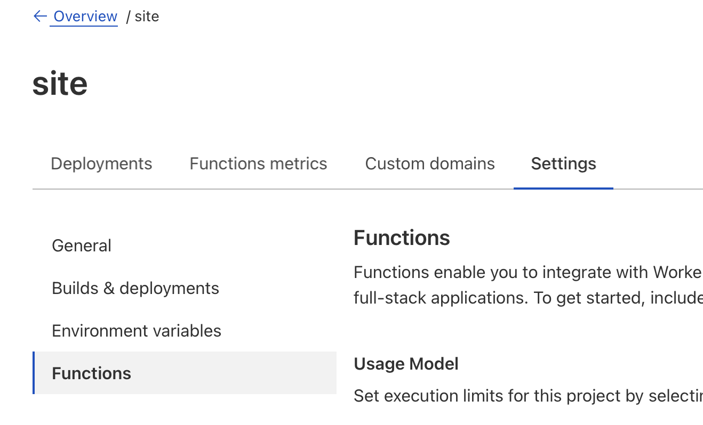

# Serverless Astro WebAuthn with D1 Starter
This is a [template repository](https://docs.github.com/en/repositories/creating-and-managing-repositories/creating-a-repository-from-a-template) for creating a personal website with [Astro](https://astro.build) hosted on [Cloudflare Pages](https://pages.cloudflare.com). Here's how you may expect your site to look:

Check out [my site](https://aostil.es) for a live demo.  
[Read more](https://buttondown.email/aostiles/archive/serverless-webauthn-with-astro-cloudflare-pages/?tag=gh) about lessons I learned creating my site.  
This template will create for you a site with the following features:
- **Serverless**: No webservers or databases to manage.
- **WebAuthn login**: Login without relying on third-party services or storing passwords.
- **Private friends area**: Post updates to your friends without sharing to the entire world.
- **Spam-free contact form**: Let strangers reach out without revealing your email address. Protected by [Turnstile](https://developers.cloudflare.com/turnstile/).
- **Admin dashboard**: See who has contacted you.

## Get Started

1. Follow [these instructions](https://docs.github.com/en/repositories/creating-and-managing-repositories/creating-a-repository-from-a-template#creating-a-repository-from-a-template) to create a new GitHub repository from this template.
2. Follow [these instructions](https://developers.cloudflare.com/pages/framework-guides/deploy-an-astro-site/#deploying-with-cloudflare-pages) to connect Cloudflare Pages to your GitHub account. **Note that you'll need to set `NODE_VERSION` to at least `16.12.0`.** Your first build will likely fail because we haven't yet setup the D1 database or necessary environment variables.
3. Follow the following two subsections to set up the D1 database and environment variables
4. Trigger a re-deploy with a dummy commit: `git commit -m "dummy commit" --allow-empty`

### Set up the D1 Database
[D1](https://developers.cloudflare.com/d1/) is Cloudflare's serverless database based on SQLite. You'll want their [command-line tool](https://developers.cloudflare.com/workers/wrangler/) to create a database:
```
cd <this repo>
npm install  # includes wrangler
npx wrangler login
npx wrangler d1 create site  # create a new db and call it 'site'
npx wrangler d1 execute SITE_DB --file=./schema.sql  # set up the schema on the remote database
```
Now create a binding in the Cloudflare dashboard:


The code in this repo assumes the name `SITE_DB`.

Create a `wrangler.toml` file in the root of this repo with the following contents:
```
[[d1_databases]]
binding = "SITE_DB"
database_name = "site"
database_id = "<database ID from the D1 dashboard>"
```

### Set up Environment Variables
Go to the Cloudflare dashboard for your site and set up the following environment variables. Here's what mine look like:

Here's what some of the variables do. The `PUBLIC_` prefix is a quirk of Astro and can be ignored.
| Variable | Description |
| -------- | ----------- |
| PUBLIC_SITE_NAME | The name of your site. Used in the header and title. |
| PUBLIC_SITE_OWNER | Used to allow only a certain username in to the admin section. |
| PUBLIC_SITE_TAGLINE_TITLECASE | Used to display the tagline in the header. |
| PUBLIC_TURNSTILE_SECRET_KEY | Used to validate contact form submissions. |
| PUBLIC_TURNSTILE_SITE_KEY | Used when initializing Turnstile on the client. |

## Approving Friend Registrations

I haven't coded a UI for this. I use the online D1 console.
You can find it at https://dash.cloudflare.com.
Click on "Workers & Pages" and then on "D1".  

```
INSERT INTO users (username)
SELECT username FROM reg_requests
WHERE id=<reg_request id>;

INSERT INTO creds (user_id, cred)
SELECT users.id, reg_requests.cred
FROM users, reg_requests
WHERE users.username = <username you just created> AND reg_requests.id = <reg_request id>;
```

## Featured Posts
If you have any newsletter posts you'd like to display directly on your site, you can do so with:
```
INSERT INTO featured_posts (title, url, created_at) VALUES ('My Newsletter Post', 'https://', DATE('2023-06-27'));
```

## Credits
I used https://github.com/passwordless-id/webauthn and found their library and docs helpful.  
This template includes their bundled client-side code at `public/webauthn.min.js`. That code is theirs and is covered by their (also MIT) license.

## Contributing
Please see [CONTRIBUTING.md](CONTRIBUTING.md).
